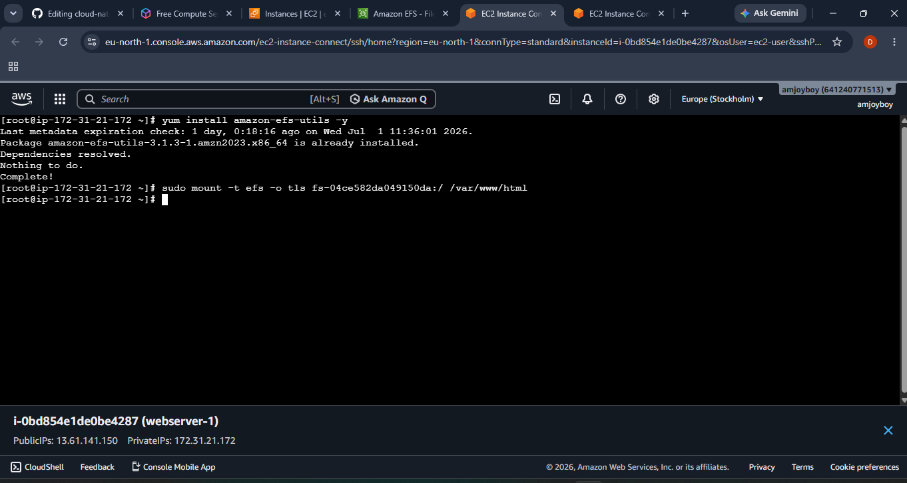
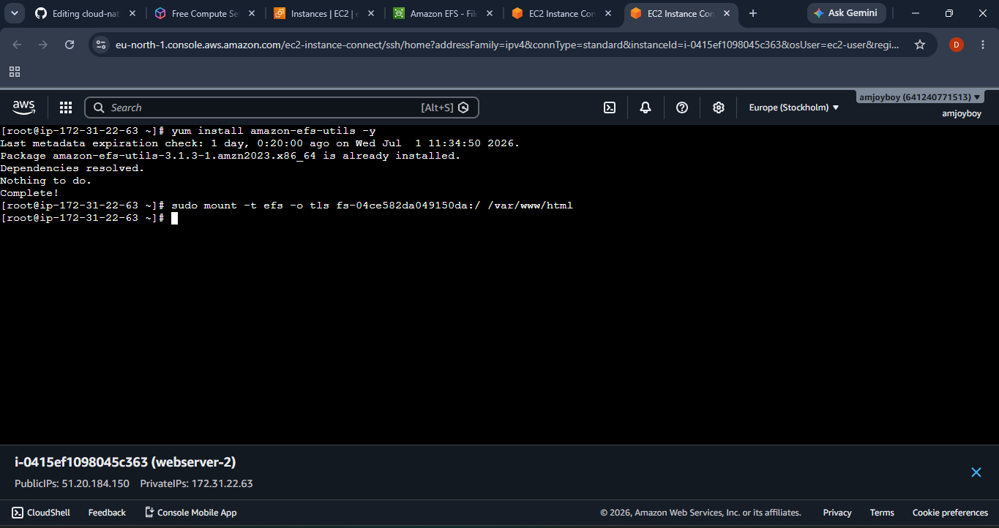
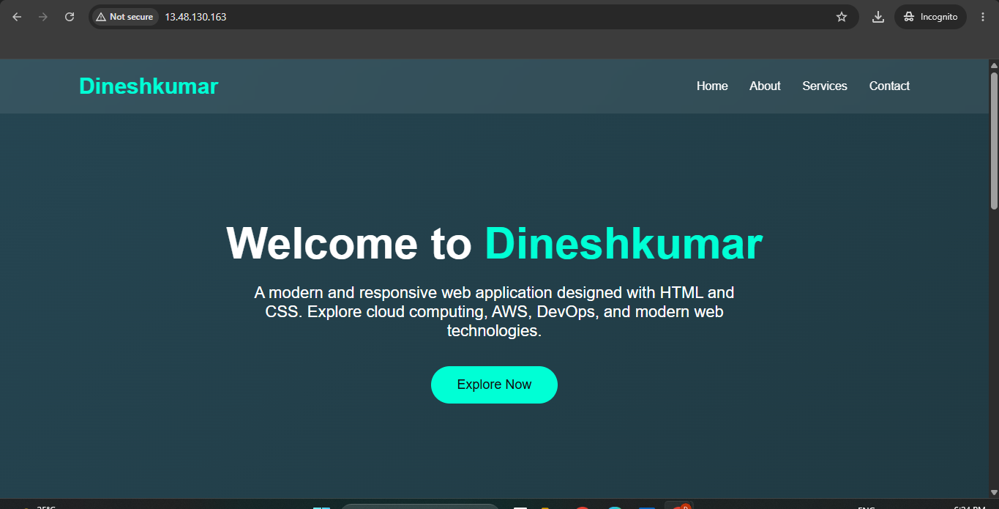
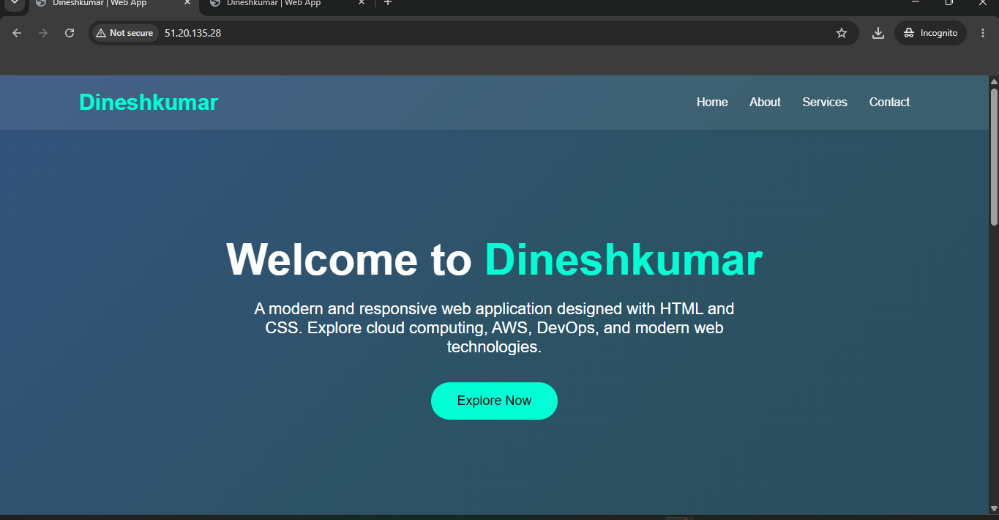

# ☁️ Cloud-Native Highly Available Web Application on AWS

A cloud-native AWS project demonstrating how to deploy a highly available web application using **Amazon EC2** and **Amazon Elastic File System (EFS)**. Multiple web servers share the same website content through a centralized file system.

---

## 📖 Project Overview

This project demonstrates a shared storage architecture using **Amazon EFS** and **Amazon EC2**. Two Apache web servers are connected to the same Amazon EFS file system, allowing both servers to serve identical website content from a single shared location.

---

## 🚀 Features

- Launch multiple Amazon EC2 instances
- Configure Apache Web Server
- Create and Mount Amazon EFS
- Shared Website Storage
- Linux Administration
- Secure Networking using VPC & Security Groups
- High Availability Architecture

---

## ☁️ AWS Services Used

- Amazon EC2
- Amazon EFS
- Amazon VPC
- Security Groups
- Amazon Linux 2023
- Apache HTTP Server

---

## 🏗️ Architecture

```text
                     Internet
                         │
                  Public IP Address
                         │
        ┌────────────────┴────────────────┐
        │                                 │
+-------------------+          +-------------------+
|   EC2 Web Server1 |          |   EC2 Web Server2 |
|   Apache HTTPD    |          |   Apache HTTPD    |
+---------+---------+          +---------+---------+
          \                            /
           \                          /
            \                        /
             +----------------------+
             |      Amazon EFS      |
             |  Shared File System  |
             +----------------------+
```

---

## ⚙️ Implementation Steps

### Step 1 – Launch EC2 Instances

- Launch two Amazon Linux 2023 EC2 instances.
- Configure Security Groups for SSH (22), HTTP (80), and NFS (2049).

### Step 2 – Install Apache

```bash
sudo yum install httpd -y
sudo systemctl enable httpd
sudo systemctl start httpd
```

### Step 3 – Install Amazon EFS Utilities

```bash
sudo yum install amazon-efs-utils -y
```

### Step 4 – Mount Amazon EFS

```bash
sudo mount -t efs -o tls fs-xxxxxxxx:/ /var/www/html
```

### Step 5 – Create Website

```bash
cd /var/www/html
sudo vi index.html
```

### Step 6 – Verify

Open the Public IP of either EC2 instance.

Both servers display the same webpage because they share the same Amazon EFS storage.

---

# 📷 Project Screenshots

## 🖥️ Web Server 1 Terminal



---

## 🖥️ Web Server 2 Terminal



---

## 🌐 Website Output (Server 1)



---

## 🌐 Website Output (Server 2)



---

## 📂 Repository Structure

```text
Cloud-Native-Highly-Available-Web-Application-on-AWS/
│
├── README.md
├── index.html
├── server1-terminal.png
├── server2-terminal.png
├── website-output1.png
└── website-output2.png
```

---

## 💡 Skills Demonstrated

- AWS Cloud
- Amazon EC2
- Amazon EFS
- Linux Administration
- Apache HTTP Server
- Amazon VPC
- Security Groups
- Shared Storage
- High Availability

---

## 📚 Learning Outcomes

- Created and configured Amazon EFS.
- Mounted EFS on multiple EC2 instances.
- Hosted a centralized Apache website.
- Verified shared storage across servers.
- Strengthened AWS and Linux administration skills.

---

## 🔮 Future Enhancements

- Application Load Balancer (ALB)
- Auto Scaling Group
- Amazon CloudWatch Monitoring
- Route 53 DNS
- HTTPS using AWS Certificate Manager
- CI/CD with Jenkins or GitHub Actions

---

## 👨‍💻 Author

**Dineshkumar R**

**Aspiring AWS Cloud & DevOps Engineer**

- https://github.com/dineshkumarrp22-ops
- www.linkedin.com/in/dinesh-kumar-engr

⭐ If you found this project useful, consider giving it a **Star** on GitHub.
